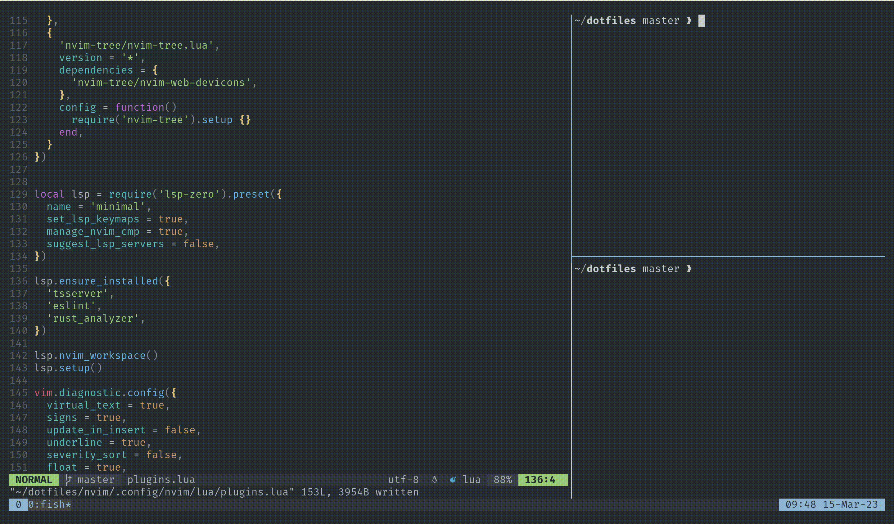

# Dotfiles


> A lightweight configuration of Kitty terminal, Tmux and Neovim.

These dotfiles provide LSP-based auto-completion and fuzzy search for Neovim, as well as allowing easy navigation through Tmux panes and Nvim buffers using the same keybindings. This makes Neovim as powerful as an IDE, and even better!

## Key featrures

- ⚡ **Super lightweight**. Here's a pretty limited set of plugins and tools to make Neovim work fast and really efficient at the same time.
- 🔌 **Lua powered configs**. Completely rewritten in Lua Neovim's configuration makes it easier extensible and faster.
- 🖇️ **Tight integration of Nvim and Tmux**. Jump across a project without obstetrical, work line there's no borders anymore.



## Get started

For a completely automated installation, you need to use Fedora and [Ansible](https://www.ansible.com/). With this setup, you can just run the following command:

```
make
```

But you still can use all these dotfiles in any OS you want. Just copy dotfiles of your choise or install in using [GNU Stow](https://www.gnu.org/software/stow/).

### Tmux


1. Session name
2. Inactive window
3. Active window
4. Active pane
5. Simple date/time info panel


To jump between panes and vim buffers you can use <kbd>Ctrl</kbd> + <kbd>h</kbd> / <kbd>j</kbd> / <kbd>k</kbd> / <kbd>l</kbd>. These keybindings work across all working environment.
